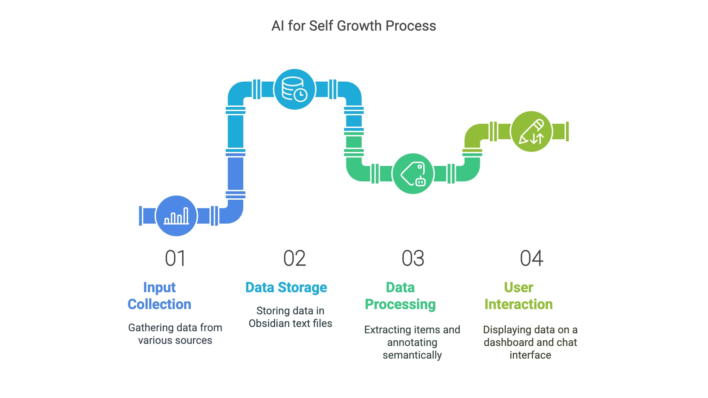
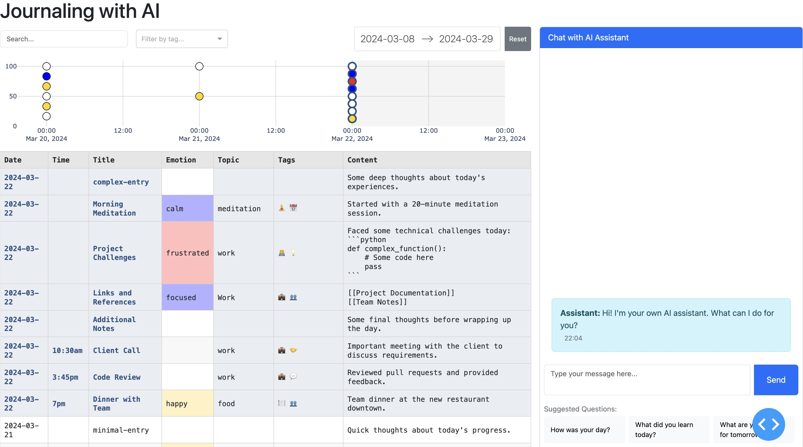
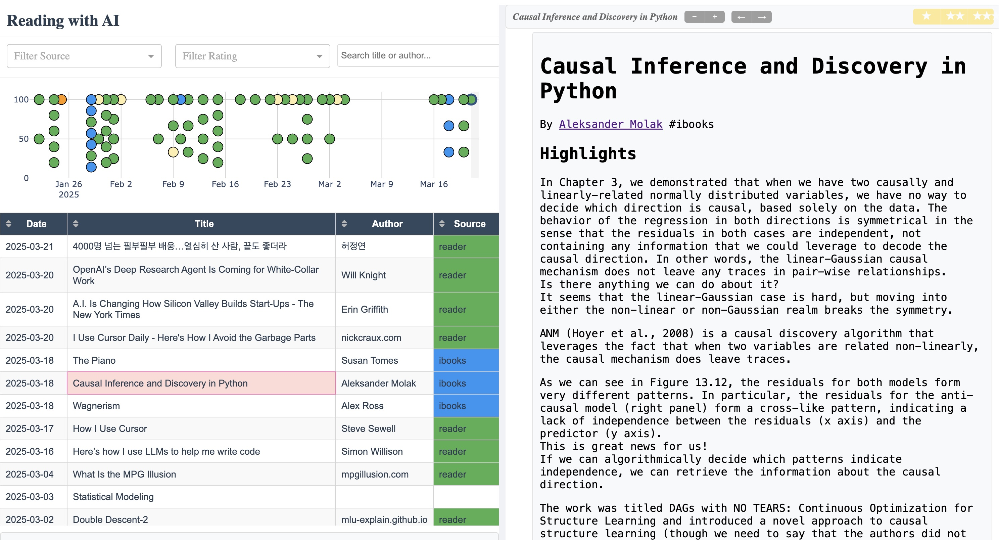
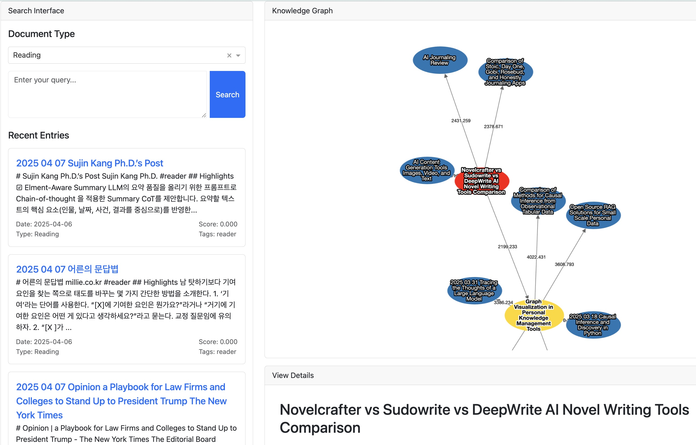

# AI for Self-growth 

## AI-Powered Journal Analysis

A dash-based application that processes and visualizes journal entries with AI-powered semantic analysis. 
The system extracts daily journal entries from markdown files, adds semantic tags using GPT-4, and provides an interactive dashboard for exploration.
To help with reflection and planning, an AI assistant based on recent journal entries is being built. 






## AI-Powered Reading List

A Dash-based reading interface that processes and visualizes your reading history from various sources (iBooks, Kindle, Medium, Instapaper, Pocket, etc.). The system extracts reading entries and provides an interactive dashboard for exploring and managing your reading history.

Features:
- **Multi-source Integration**: Supports reading history from various platforms
- **Interactive Timeline**: Visual representation of reading activity over the past 60 days
- **Rating System**: Built-in 3-star rating system for books and articles
- **Search & Filter**: Find entries by title, author, source, or rating
- **Responsive Layout**: Clean, adjustable reading interface with customizable font size and margins
- **Quick Actions**: One-click Google search for books and articles



## Knowledge Graph Visualization

A powerful graph-based visualization tool that helps you explore connections between your journal entries, reading materials, and other documents. The knowledge graph provides an interactive way to discover relationships and patterns in your personal knowledge base.

Features:
- **Interactive Graph**: Visualize connections between documents with an interactive network graph
- **Semantic Search**: Find related documents based on content similarity
- **Document Exploration**: Click on nodes to expand the graph and discover related content
- **Document Type Filtering**: Filter by document type (journal, reading, etc.)
- **Recent Entries**: Browse your most recent entries with pagination
- **Detailed View**: View full document content and metadata when selecting a node



## Features

- **Journal Entry Extraction**: Processes markdown files from Obsidian or similar note-taking apps
- **Semantic Analysis**: Uses GPT-4 to add emotion, topic, and contextual tags to entries
- **Interactive Dashboard**: Visualizes entries with timeline and detailed table views
- **Real-time Updates**: Automatically detects and processes new entries
- **Search & Filter**: Find entries by date, content, or tags
- **API Caching**: Optimizes API usage by caching GPT-4 responses
- **Reading History**: Tracks and visualizes reading activity across multiple platforms
- **Book Management**: Rate and organize your reading materials
- **Knowledge Graph**: Interactive visualization of document relationships and connections
- **Semantic Search**: Find related documents based on content similarity

## Prerequisites

- Python 3.8 or higher
- OpenAI API key
- Obsidian or similar markdown-based note-taking app

## Installation

1. Clone the repository:
```bash
git clone https://github.com/yourusername/AI4SG.git
cd AI4SG
```

2. Install required packages:
```bash
pip install -r requirements.txt
```

3. Set up your OpenAI API key:
```bash
export OPENAI_API_KEY=your_api_key_here
```

4. Configure the application:
   - Copy `config.yaml.example` to `config.yaml`
   - Update the paths in `config.yaml` to match your system:
     ```yaml
     input_dir: "input"  # Directory for raw journal files
     output_dir: "output"  # Directory for processed files
     api_cache_dir: "api_cache"  # Directory for API response cache
     agent_cache_dir: "agent_cache"  # Directory for caching agent responses
     journal_dir: "~/path/to/your/journal"  # Your journal directory
     ```

## Usage

### Running the Dashboard

Start the journal dashboard application:
```bash
python dash_journal.py
```

The journal dashboard will be available at http://127.0.0.1:8050/

Start the reading dashboard application:
```bash
python dash_reading.py
```

The reading dashboard will be available at http://127.0.0.1:8051/

Start the knowledge graph visualization:
```bash
python dash/dash_graph.py
```

The knowledge graph dashboard will be available at http://127.0.0.1:8052/

### Manual Processing

1. Extract journal entries:
```bash
python extract_journal.py
```

2. Annotate entries with semantic tags:
```bash
python annotate_journal.py --input journal_entries.csv
```

3. Index documents for the knowledge graph:
```bash
python index_documents.py
```

### Dashboard Features

- **Timeline View**: Visual representation of entries over time
- **Data Table**: Detailed view of all entries with tags
- **Search**: Find entries by content or tags
- **Date Range**: Filter entries by date
- **Auto-Update**: Dashboard refreshes automatically when new entries are found
- **Manual Refresh**: Press Ctrl+Z to force a refresh of entries

### Knowledge Graph Features

- **Interactive Graph**: Click and drag nodes to rearrange the graph
- **Node Expansion**: Click on a document node to find related documents
- **Document Details**: Hover over nodes to see document details
- **Document Type Filtering**: Filter by document type (journal, reading, etc.)
- **Recent Entries**: Browse your most recent entries with pagination
- **Semantic Search**: Find related documents based on content similarity

### Chat and Agent Features

- **Interactive Chat**: Engage with an AI assistant to analyze your journal entries
  - Ask questions about patterns and insights
  - Get personalized recommendations
  - Explore emotional trends and themes

- **Agent Mode**: Enhanced analysis capabilities
  - Access to full journal context
  - Code-aware responses for technical entries
  - Deep search across historical entries
  - Contextual understanding of your personal goals and progress

- **Quick Select Questions**: Pre-configured prompts for common inquiries
  - Status updates
  - Next action recommendations
  - Reflection prompts

## Configuration

The application is configured through `config.yaml`:

```yaml
# Directory Settings
input_dir: "input"  # Directory containing raw journal files
output_dir: "output"  # Directory for processed files
api_cache_dir: "api_cache"  # Directory for caching API responses
agent_cache_dir: "agent_cache"  # Directory for caching agent responses
journal_dir: "~/path/to/your/journal"  # Your journal directory

# API Settings
openai_api_key: ""  # Set via environment variable

# Processing Settings
min_process_interval: 600  # Minimum seconds between processing runs
max_entries_for_prompt: 10  # Maximum number of entries to include in GPT-4 prompts
max_word_count: 30  # Maximum words to show in abbreviated messages

# BM25 Search Settings
bm25:
  final_k: 10  # Number of results to return from BM25 search

# UI Settings
suggested_questions:  # Questions shown as quick-select buttons
  - "What's the status so far?"
  - "What should I do next?"
  - "Anything to reflect on?"
```

### Configuration Options

- **Directory Settings**:
  - `input_dir`: Directory containing raw journal markdown files
  - `output_dir`: Directory for processed CSV files and chat logs
  - `api_cache_dir`: Directory for caching GPT-4 API responses
  - `agent_cache_dir`: Directory for caching agent conversation responses
  - `journal_dir`: Path to your main journal directory

- **API Settings**:
  - `openai_api_key`: Your OpenAI API key (set via environment variable)

- **Processing Settings**:
  - `min_process_interval`: Minimum time between automatic processing runs (seconds)
  - `max_entries_for_prompt`: Maximum number of entries to include in GPT-4 prompts
  - `max_word_count`: Maximum words to show in abbreviated messages

- **BM25 Search Settings**:
  - `final_k`: Number of results to return from BM25 search

- **UI Settings**:
  - `suggested_questions`: List of questions shown as quick-select buttons in the chat interface

## Testing

The project includes a test environment for development and testing purposes. The test dashboard runs on a separate port and uses test data directories.

### Test Data Setup

1. Create test data directories:
```bash
mkdir -p test_data/{output,api_cache,agent_cache}
```

2. Run the test dashboard:
```bash
python test_dash_journal.py
```

The test dashboard will be available at http://127.0.0.1:8049/

### Test Environment Features

- **Separate Port**: Runs on port 8049 to avoid conflicts with the main dashboard
- **Test Data Directories**: Uses isolated directories under `test_data/`:
  - `test_data/output/`: Processed journal entries and chat logs
  - `test_data/api_cache/`: Cached API responses
  - `test_data/agent_cache/`: Cached agent responses
- **No Chat History**: Test environment starts with a clean chat history
- **Demo Mode**: Includes "(demo)" suffix in the dashboard title
- **Test Configuration**: Uses `TestConfig` class with test-specific settings

### Test Data Processing

The test environment uses the same processing pipeline as the main application but with test-specific configurations:

1. **Extraction**: Processes test journal entries from `input/` directory
2. **Annotation**: Adds semantic tags using GPT-4
3. **Dashboard**: Displays processed entries in the test interface

### Development Workflow

1. Make changes to the codebase
2. Test changes using the test dashboard
3. Verify functionality in the main dashboard
4. Commit changes when ready

## Project Structure

```
AI4SG/
├── config.yaml           # Configuration file
├── dash_journal.py       # Journal dashboard application
├── dash_reading.py       # Reading dashboard application
├── dash/                 # Dashboard modules
│   ├── dash_graph.py     # Knowledge graph visualization
│   └── ...               # Other dashboard components
├── extract_journal.py    # Journal entry extraction
├── annotate_journal.py   # Semantic analysis
├── index_documents.py    # Document indexing for knowledge graph
├── tagging_prompt.md     # GPT-4 prompt template
├── input/               # Raw journal files
├── output/              # Processed files
├── media/              # Media files (images, etc.)
├── api_cache/          # Cached API responses
└── test/               # Test files and data
```

## Contributing

1. Fork the repository
2. Create your feature branch (`git checkout -b feature/amazing-feature`)
3. Commit your changes (`git commit -m 'Add some amazing feature'`)
4. Push to the branch (`git push origin feature/amazing-feature`)
5. Open a Pull Request

## License

This project is licensed under the MIT License - see the LICENSE file for details. 